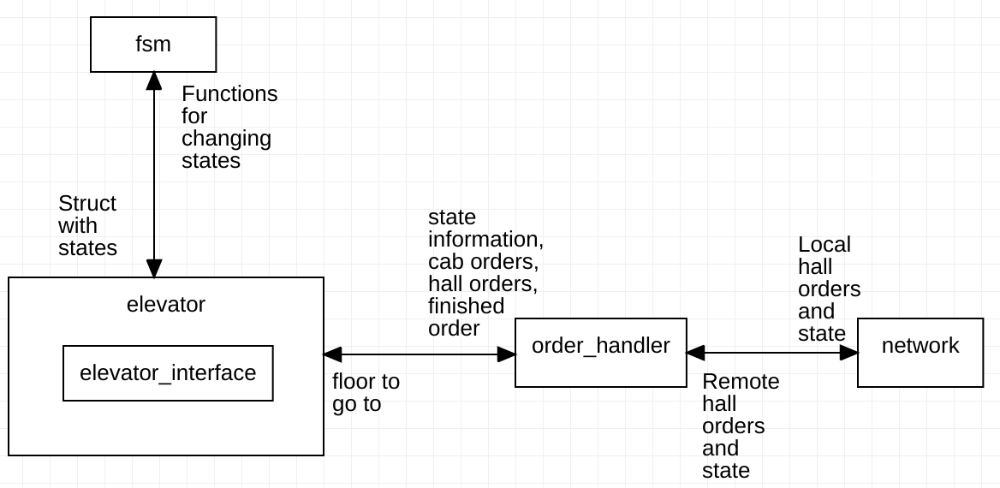

# Description

## Network module
* Establishes connection to remote elevators
 * Broadcasts local erlang:node() to network by UDP
 * Adds remote erlang:nodes() to process list by UDP
* Order_handler will message pass directly to other connected erlang:nodes() by the bang (!) operator

## Order handler module
* Controls the individual elevator based on existing orders and states of remote and local elevator
* Adds and removes orders continuously
* Stores existing orders in containers
  * One for all hall orders
  * One for local cab orders
* Cost function for choosing which elevator to handle an order
  * Communicates and compares cost over network to other elevators

## Elevator module
* Controls the logic of the individual elevator
### Elevator interface
* Interface for controlling elevator hardware
* Receives motor direction, stop and start, button light signals etc.
* Sends sensor signals, button signals etc.

## FSM module
* Holds the different elevator states and values
  * Moving
  * Idle
  * Door open
  * Direction
  * Floor
  * ...
